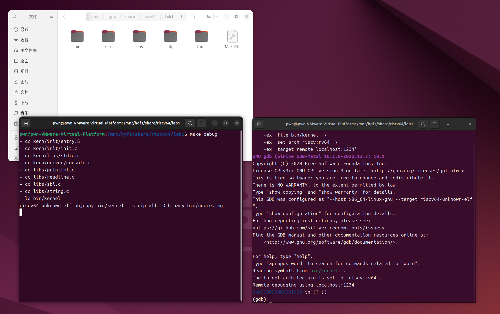
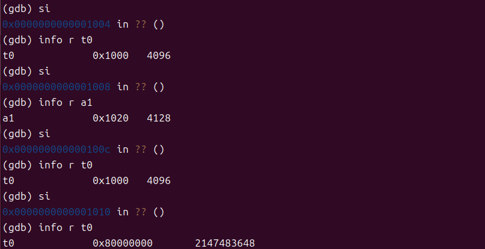
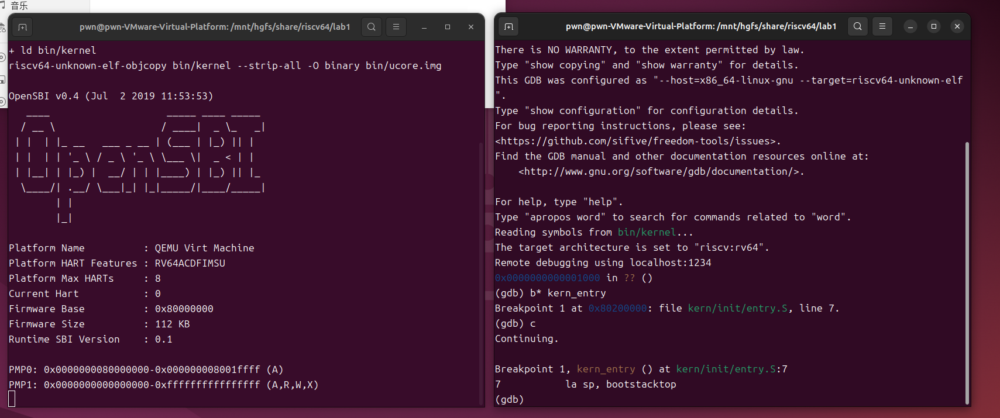

# lab1: 比麻雀更小的麻雀（最小可执行内核）

## 练习1：理解内核启动中的程序入口操作

**阅读 kern/init/entry.S内容代码，结合操作系统内核启动流程，说明指令 la sp, bootstacktop 完成了什么操作，目的是什么？ tail kern_init 完成了什么操作，目的是什么？**

kern/init/entry.S源代码如下：

```assembly
#include <mmu.h>
#include <memlayout.h>

.section .text,"ax",%progbits
    .globl kern_entry
kern_entry:
    la sp, bootstacktop
    tail kern_init

.section .data
    .align PGSHIFT             # .align 12
    .global bootstack
bootstack:
    .space KSTACKSIZE          # .space 4096
    .global bootstacktop
bootstacktop:
```

### la sp, bootstacktop

- la 是伪指令 `Load Address` ，用来将符号地址加载到寄存器中
- `.space KSTACKSIZE` 在 .data 段里分配了一块大小为 KSTACKSIZE 的内存空间，这块空间的起始地址用符号 bootstack 标记
- 这里把符号 `bootstacktop` 的地址加载到寄存器 `sp` 中

操作：将栈指针设置为预先分配的大小为 KSTACKSIZE 的栈空间的顶部。

目的：为内核执行C语言代码初始化内核栈。

### tail kern_init

操作：tail 是尾调用（Tail Call）伪指令，跳转到 kern_init 函数，但不保存返回地址到栈中。相当于直接跳转而不是函数调用。

目的：因kern_entry是内核入口，执行后不需返回。这里高效地转移到内核主初始化函数，避免创建不必要的栈帧。

## 练习2: 使用GDB验证启动流程

**为了熟悉使用 QEMU 和 GDB 的调试方法，请使用 GDB 跟踪 QEMU 模拟的 RISC-V 从加电开始，直到执行内核第一条指令（跳转到 0x80200000）的整个过程。通过调试，请思考并回答：RISC-V 硬件加电后最初执行的几条指令位于什么地址？它们主要完成了哪些功能？请在报告中简要记录你的调试过程、观察结果和问题的答案。**

按照参考手册在两个终端分别执行命令，开始调试



gdb成功连接后显示位置 `0x0000000000001000` ，说明加电后最先执行的指令位于 0x1000 地址处。

输入指令 `x/10i $pc` 查看接下来要执行的代码

```
(gdb) x/10i $pc
=> 0x1000:        auipc        t0,0x0
   0x1004:        addi        a1,t0,32
   0x1008:        csrr        a0,mhartid
   0x100c:        ld        t0,24(t0)
   0x1010:        jr        t0
   0x1014:        unimp
   0x1016:        unimp
   0x1018:        unimp
   0x101a:        0x8000
   0x101c:        unimp
```

进行单步执行



可以发现地址为 `0x1010` 的指令处会跳转到   `0x80000000`，跳转后执行的是 OpenSBI 的启动代码，主要负责完成系统级初始化，并将控制权转交给内核入口  `0x80200000`。

先对 `kern_entry` 函数下断点，随后执行开始执行程序。根据链接脚本 `kernel.ld`，内核加载基地址（BASE_ADDRESS）定义为 0x80200000，入口点（ENTRY）定义为 kern_entry，因此内核从此处开始执行。



此时内核的第一条指令即将开始执行，表示 OpenSBI 已完成启动过程。

以上是实验过程，下面回答练习2的问题。

- RISC-V 硬件加电后最初执行的指令位于物理地址 `0x00001000`。

- 这些指令主要完成的功能：
    - `auipc t0,0x0`：（Add Upper Immediate to PC）将当前PC值的高20位与0相加存入t0，执行后：t0 = 0x1000，这条指令的目的是获取当前指令的地址。由于RISC-V的指令地址可能因为实现而异，使用 auipc 是一种位置无关的编程方法，确保代码在任何加载地址都能正确运行。
    - `addi a1,t0,32`：将t0+32（0x1020）存入a1，执行后：a1 = 0x1020。在RISC-V的启动约定中，寄存器 a1 通常用于传递设备树的地址。
    - `csrr a0,mhartid`：（Control and Status Register Read）读取当前硬件线程ID到a0，执行后：a0 = 0x0（主硬件线程）。OpenSBI需要知道是哪个硬件线程正在启动，以便进行后续的调度和初始化工作。
    - `ld t0,24(t0)`：从t0+24（0x1018）处加载数据到t0，执行后：t0 = 0x80000000
    - `jr t0`：跳转到t0指向的地址（0x80000000），执行后：PC = 0x80000000

    这五条指令为启动 `OpenSBI` 准备必要的执行环境，并完成控制权的移交。

## 总结

**列出你认为本实验中重要的知识点，以及与对应的OS原理中的知识点，并简要说明你对二者的含义，关系，差异等方面的理解（也可能出现实验中的知识点没有对应的原理知识点）**


- `栈初始化` 使用 .space KSTACKSIZE 在内核数据段分配栈空间。通过 la sp, bootstacktop 将栈指针指向栈顶。为内核执行C语言代码初始化内核栈。

- `Bootloader` 实验：加电后第一条指令位于 0x1000，执行引导代码；引导代码读取硬件线程ID，加载设备树地址，并跳转到OpenSBI（0x80000000）；OpenSBI初始化后跳转到内核入口 0x80200000。
    OS原理：Bootloader/BIOS 负责初始化硬件，建立基本运行环境，加载并移交控制权给内核。
    - `含义` Bootloader 是介于硬件和操作系统之间的软件层，负责早期硬件初始化和内核加载
    - `关系` 实验中 OpenSBI 充当了 Bootloader 的角色
    - `差异` RISC-V 使用 OpenSBI 作为标准引导固件，而x86架构使用 BIOS/UEFI，启动流程和机制不同

- `内存布局` 内核加载地址为 0x80200000，由链接脚本 kernel.ld 定义，入口符号为 kern_entry。链接脚本定义了内核在内存中的组织结构，确保代码和数据位于正确位置。现代OS还支持地址空间随机化（ASLR）或动态加载。

- `可执行文件` 在Linux系统中，有两种不同的可执行文件格式：elf (executable linkable format) 和 bin (binary)。如果我们已经有一个完整的操作系统来解析 elf 文件，那么 elf 文件可以直接执行。但是对于 OpenSBI 来说，elf 格式相对复杂。

- `地址相关代码` 是指在编译和链接时，其指令中的内存地址（如变量、函数的地址）被硬编码为最终的绝对地址。程序运行时，它必须被加载到链接时指定的这个固定内存地址才能正确执行。

    `地址无关代码` 是指，其指令不依赖于代码被加载到的绝对内存地址。无论操作系统将它加载到内存的哪个位置，它都能正确执行。

- `输入输出` 标准库的 printf 本质上就是调用了操作系统内核提供的接口。
    - OpenSBI 提供了一些基础服务，比如设置定时器、发送处理器间中断，以及我们最需要的控制台输入输出
    - 调用 OpenSBI 基础服务不能像普通函数那样使用 call 指令。因为我们的内核运行在 S 模式，而 SBI 服务运行在更高的 M 模式。跨越这种特权级别的调用，需要使用特殊的指令——ecall（Environment Call）
    
        通过 ecall 调用 SBI 服务需要在一个预定义的表格中查找一个功能号，然后按照固定的规则传递参数（系统调用的调用格式），最后执行一个特殊指令来触发它
    - 从 QEMU 内置的 OpenSBI 固件中最原始的“输出一个字符”的接口开始，层层封装，最终构建出我们需要的、功能强大的 cprintf 函数

## 补充

- 分页机制简介：

    分页机制用于实现虚拟地址与物理地址的分离。操作系统将进程空间划分为固定大小的页，并通过页表将虚拟页号映射到物理页框，页表中还包含有效位、访问位和修改位等控制信息。CPU 访问内存时，地址会经过内存管理单元（MMU）进行转换：CPU 发出的虚拟地址首先由 TLB（快表）查询，如果命中则直接得到物理地址；若未命中，则访问页表完成映射。若页表项无效，会触发缺页异常，由操作系统分配新页框或从磁盘调入数据后更新页表。为提升效率，现代系统常采用多级页表或反置页表结构，以降低页表存储开销并提高查找速度。

    实验中未涉及的原因：
本次实验的重点在于内核的启动与初始化过程，运行环境仅使用物理地址空间。系统尚未开启 MMU，也没有建立页表结构，因此栈指针 sp 直接指向物理地址 bootstacktop，没有虚拟与物理地址的映射关系。

- 上下文切换简介：

    在多道程序系统中，为了实现并发执行，操作系统会在多个进程之间交替分配CPU时间，这就需要“上下文切换”机制。上下文切换指操作系统保存当前正在运行进程的上下文信息（寄存器组、栈指针、程序计数器等），并恢复下一个被调度进程的上下文，使CPU能从一个进程无感知地切换到另一个进程继续运行。

    实验中未涉及的原因：
本次实验主要聚焦内核启动的早期阶段，仅涉及从OpenSBI跳转到内核入口的单一执行流，系统中没有多个进程或线程并行存在，也没有引入调度器，因此无需进行上下文切换。实验未建立进程控制块或运行队列等数据结构，也未触及进程的创建、就绪、阻塞与终止状态管理，因此未体现进程调度与上下文切换机制。